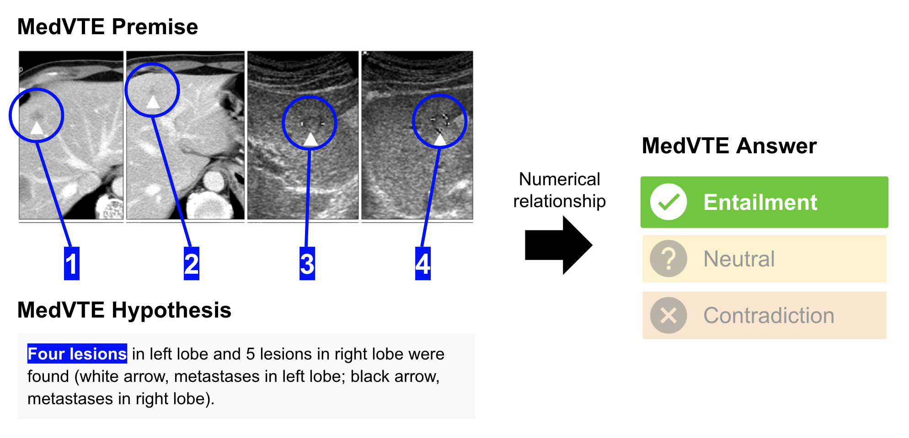
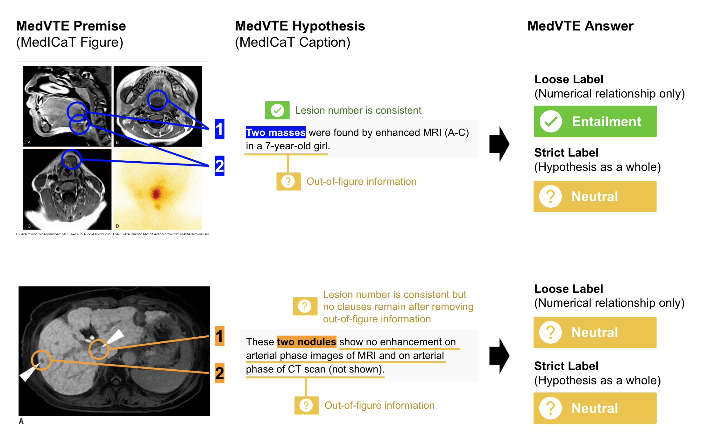

# MedVTE: Medical Visual Textual Entailment for Numerical Understanding of Vision-and-Language Models

**Hitomi Yanaka, Yuta Nakamura, Yuki Chida, Tomoya Kurosawa**

**MedVTE** is a visual textual entailment (VTE) dataset in the biomedical domain presented in [ClinicalNLP 2023 workshop](https://clinical-nlp.github.io/2023/).

MedVTE is a task to determine the numerical relationship of cancers, tumors, nodules, etc., between a premise figure and a hypothesis text. Premise figures are medical imaging test findings (radiological, endoscopic, pathological, etc.) in medical articles.

For more details, please refer to [our paper](https://aclanthology.org/2023.clinicalnlp-1.2/).



## Updates

07/09/2023:
- Release of the MedVTE dataset

## Overview

MedVTE is built using [the MedICaT dataset](https://github.com/allenai/medicat) (Subramanian et al., 2020).

MedVTE has two types of labels for each premise figure-hypothesis sentence pair:

- `Strict label`: 
  - The same label as other VTE datasets. 
  - It shows whether the **hypothesis sentence as a whole** is true (`Entailment`), false (`Contradiction`), or undecided due to insufficient information in the premise figure (`Neutral`).
    - Domain knowledge is required to correctly assign a `Neutral` label because each information in the hypothesis must be carefully examined if it is well described in the premise figure.

- `Loose label`:
  - An additional label to separately evaluate numerical inference ability.
  - It considers **only the numerical relationship** of the lesions, not all the propositions of the hypothesis.
    - `Entailment`: All lesion numbers are consistent
with the premise figure.
    - `Contradiction`: One or more lesion numbers are smaller than those in the premise figure.
    - `Neutral`: Either of the following is satisfied:
      - one or more lesion numbers are larger than those in the premise figure although the others are consistent
      - the number of lesion numbers cannot be determined only from the premise figure
      - no clauses remain after removing out-of-figure information from the hypothesis

For more details, please refer to [our paper](https://aclanthology.org/2023.clinicalnlp-1.2/).



## How to Use

The following is the instruction to create MedVTE and run a baseline model:

1. Obtain the MedICaT dataset

- This repository only contains MedVTE hypothesis sentences and labels. MedVTE figures are NOT included.
- Please ask for a download link of the MedICaT dataset via the application form at [the MedICaT repository page](https://github.com/allenai/medicat).

2. Place the MedICaT dataset in `(DIRECTORY NAME)`

```sh
(TBA)
```

3. Run a baseline model

```sh
(TBA)
```

## BibTeX
Please cite our paper using BibTeX below when publishing a paper using the MedVTE dataset:
```
@inproceedings{yanaka-etal-2023-medical,
    title = "Medical Visual Textual Entailment for Numerical Understanding of Vision-and-Language Models",
    author = "Yanaka, Hitomi  and
      Nakamura, Yuta  and
      Chida, Yuki  and
      Kurosawa, Tomoya",
    booktitle = "Proceedings of the 5th Clinical Natural Language Processing Workshop",
    month = jul,
    year = "2023",
    address = "Toronto, Canada",
    publisher = "Association for Computational Linguistics",
    url = "https://aclanthology.org/2023.clinicalnlp-1.2",
    pages = "8--18",
    abstract = "Assessing the capacity of numerical understanding of vision-and-language models over images and texts is crucial for real vision-and-language applications, such as systems for automated medical image analysis.We provide a visual reasoning dataset focusing on numerical understanding in the medical domain.The experiments using our dataset show that current vision-and-language models fail to perform numerical inference in the medical domain.However, the data augmentation with only a small amount of our dataset improves the model performance, while maintaining the performance in the general domain.",
}
```
